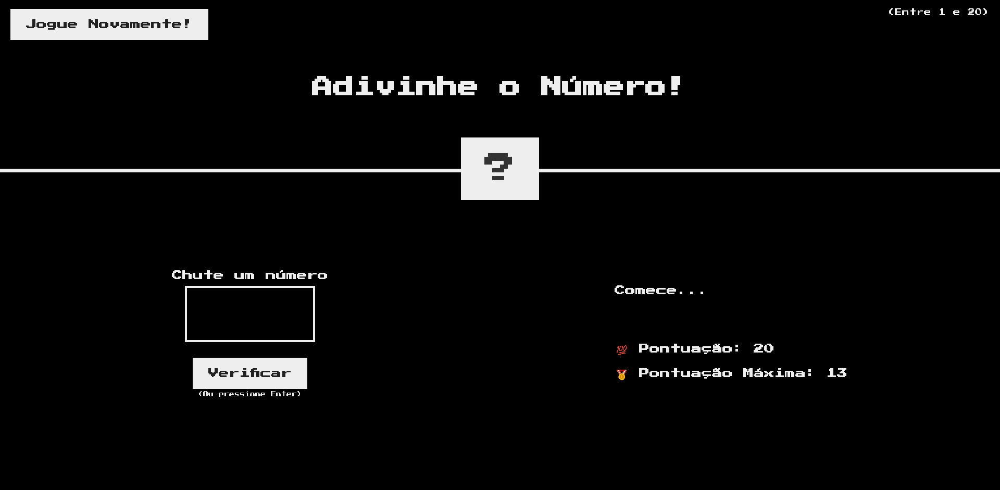
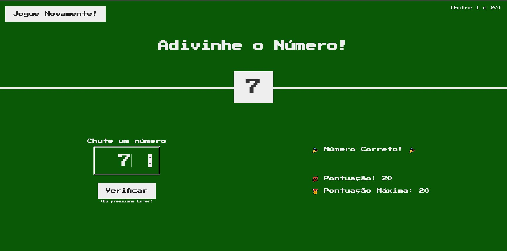

# 🔢 Adivinhe o Número

Um jogo simples em JavaScript onde o usuário precisa adivinhar um número secreto entre 1 e 20, onde a cada erro você perde um ponto. O objetivo do jogo é acertar o número secreto o mais rápido possível, garantindo as máximas pontuações. Feito para praticar lógica de programação, manipulação do DOM e interatividade com o usuário.

## 🖼️ Preview

### Página Inicial


### Número Correto


## ✨ Tecnologias Utilizadas

- HTML
- CSS
- JavaScript

## 🎯 Funcionalidades

- Geração aleatória de número
- Feedback visual e textual ao usuário
- Sistema de pontuação
- Reinício de jogo sem recarregar a página

## 🚀 Como Executar

1. Clone o repositório:
   ```bash
   git clone https://github.com/me-lucas-al/Adivinhe-O-Numero.git
